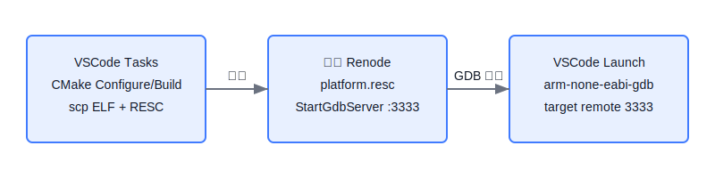

# VSCode + Renode 调试快速指南

> 环境围绕 `.vscode/tasks.json` 和 `.vscode/launch.json` 设计：VSCode 负责构建与文件分发，Renode 运行在远端（默认 `root@192.168.31.135`，GDB 端口 `3333`）。

## 一键调试（推荐）
1) 在 VSCode 侧确认已安装 `arm-none-eabi-gdb`，并能 SSH 到远端 `192.168.31.135`。若地址/用户不同，请修改 `.vscode/tasks.json` 与 `.vscode/launch.json` 中的 IP/路径。
2) F5 选择配置 `Debug STM32F412 on Renode Remote`：
   - 触发预任务 `Run Renode Remote`，自动执行：
     - `CMake Configure` + `CMake Build` 产出 `build/firmware.elf`
     - `scp` 推送 `firmware.elf` 与 `renode/platform.resc` 到远端 `/home/orangepi/object/renode_portable/`
     - 关闭旧 Renode，后台启动新实例：`renode .../platform.resc`（内含 GDB 服务器 `3333`）
   - GDB 启动后连接远端 `3333`，`postRemoteConnectCommands` 会暂停、重新加载 ELF 并重置 CPU。
3) 在 VSCode 下断点、单步、查看变量即可完成全流程调试。

## 手动启动（备用）
若不使用 VSCode 任务，可按以下顺序：
```sh
# 1) 本地构建
cmake -S . -B build -DCMAKE_BUILD_TYPE=Debug
cmake --build build --config Debug

# 2) 推送文件到远端 Renode 目录
scp build/firmware.elf renode/platform.resc root@192.168.31.135:/home/orangepi/object/renode_portable/

# 3) 远端启动 Renode（如已在跑可先 pkill renode）
ssh root@192.168.31.135 "pkill renode || true; /home/orangepi/object/renode_portable/renode /home/orangepi/object/renode_portable/platform.resc"

# 4) 本地 GDB 连接远端 3333
arm-none-eabi-gdb build/firmware.elf
(gdb) target remote 192.168.31.135:3333
(gdb) monitor machine Pause
(gdb) monitor sysbus LoadELF @/home/orangepi/object/renode_portable/firmware.elf
(gdb) monitor cpu Reset
```

## 常见修改点
- 远端 IP/用户名/路径：调整 `.vscode/tasks.json` 与 `.vscode/launch.json` 中的 `scp`/`ssh` 目标路径及 GDB 地址。
- GDB 端口：默认 `3333`，如在 `platform.resc` 修改 `StartGdbServer`，请同步更新 `launch.json` 的 `miDebuggerServerAddress`。
- ELF 名称：当前任务使用 `build/firmware.elf`，如更换目标名，请同步任务与 `platform.resc` 的 `LoadELF` 路径。

## 调试流程示意

